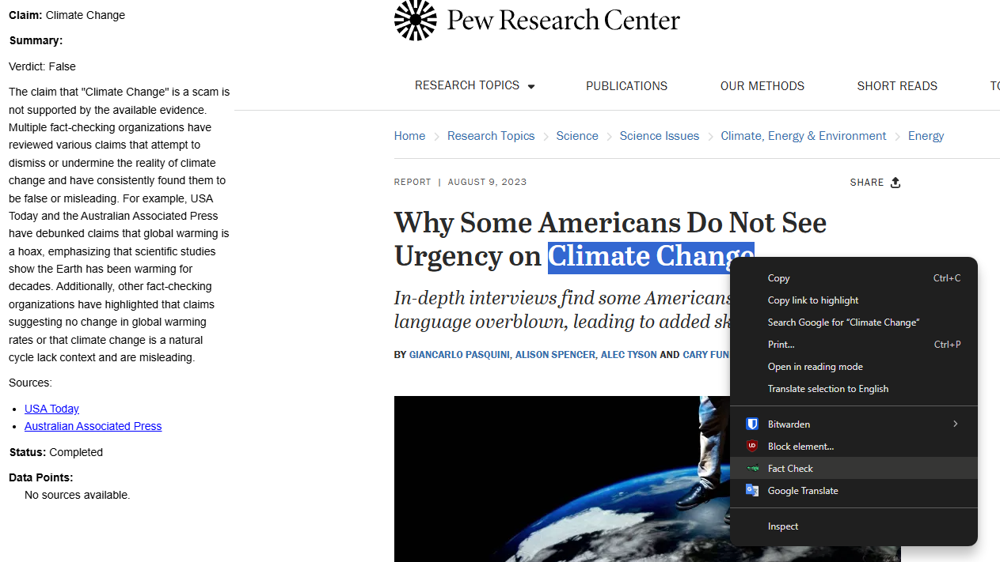
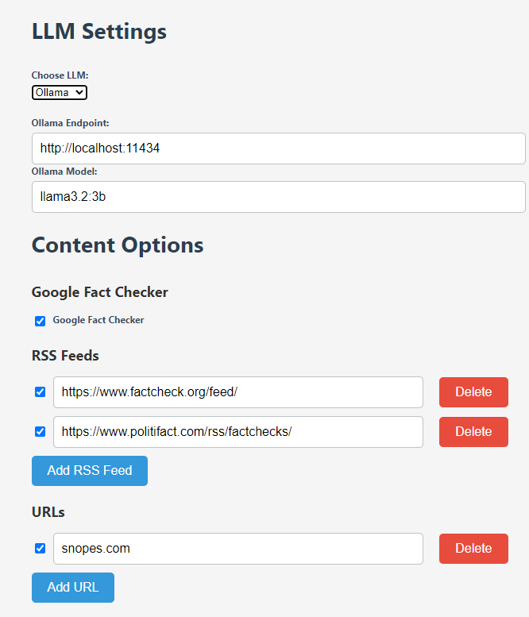
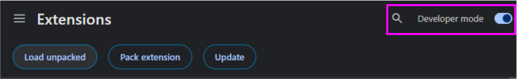
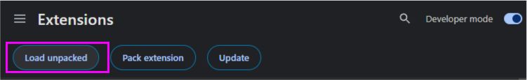
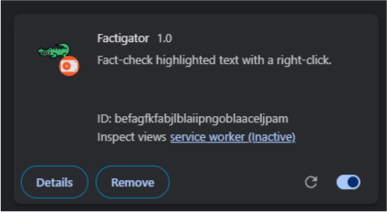
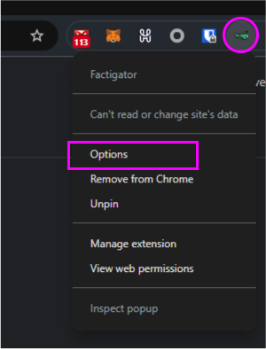
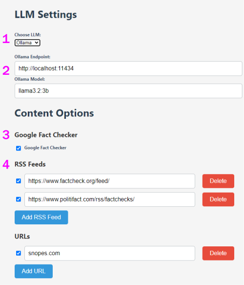

# Factigator

Factigator empowers users to combat misinformation by seamlessly fact-checking highlighted web text. Leveraging Langchain & Ollama to serve local LLM modesl (default is Llama3.2:3b) as well as OpenAI (default is gpt-4o).

It searches trusted sources and delivers concise, evidence-backed summaries—all at no cost to ensure truth is within everyone's reach

Presentation [Here](https://www.youtube.com/watch?v=UYDLT7WQfZ8)

Screen Recording [Here](https://youtu.be/YkFLnJHl8GY)

## Installation

Factigator has been submitted to the Chrome Web Store to be validated as an offical Chrome extension, and is currently pending their review.

If you would like to install it from source you can use the following instructions.

Note:

- Factigator is written to work in Chrome and Chromium forks, and has been tested in Vivaldi.
- Factigator is written to support Manifest v3 requirements

1) Enabled Developer Mode in the Chrome Extensions options
   
2) Install the extension using the Load Unpacked button. Navigate to the folder where you downloaded Factigator.
   
3) You will see this when its installed
   
4) Next, configure Factigators Options. Right click the Factigator Extension Icon
   
5) Now configure how you want Factigator to work.

	1) Select if you want to use OpenAI or Ollama. If you select Ollama you will need to have an Ollama service running. You can find out about Ollama [here](https://github.com/ollama/ollama) . For those who dont know, Ollama allows you to self host Local LLMs, and they have a great community.
	   If you select OpenAI you need to choose your model and add your API key, if you choose Ollama you need to enter the IP for Ollama and what model you want to use. I have added defaults for you.
	   
	2) The main source of fact checking comes from Googles Fact Checker tool. You can disable this if you wish.
	3) The secondary sources come from RSS feeds. I have selected 2 to include. You can disable these and/or add your own.
	   Note:

	   - URLs are not yet implemented. I am still working on this feature, but it will allow you to search specific URLs for information where that site does not already provide you an RSS feed.
	   - Also note, this section might be replaced by, or at least enhanced by the option to use [SearXNG](https://github.com/searxng/searxng) , if you have that available to you.
	4) Thats it! Now you can highlight any text and select Factigator from the righ-click menu.
